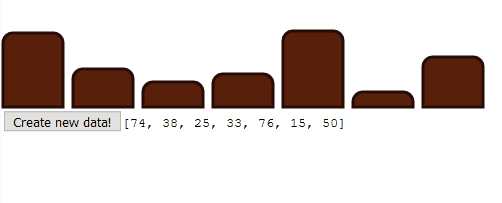

# D3 Bar Chart Test
 
Simple Bar Chart using D3.js to demonstrate Enter-Exit-Update pattern on randomly generated data. 

| | 
| -------------|
| Bars are changing color attributes depending on state:*Enter*: brown color, *Update*: white color, *Exit*: dark brown color |
